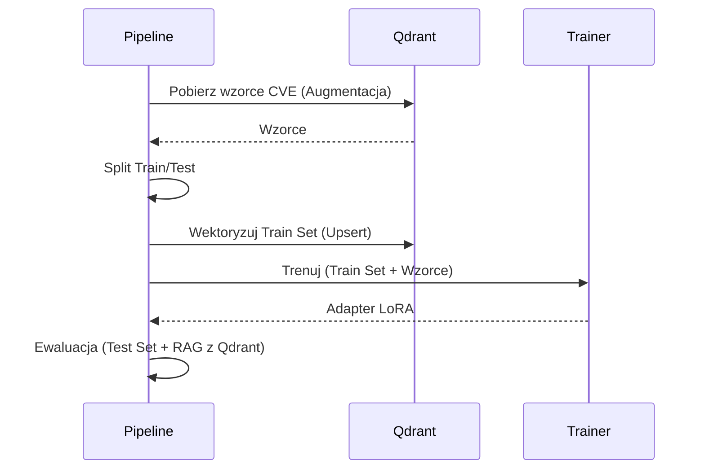
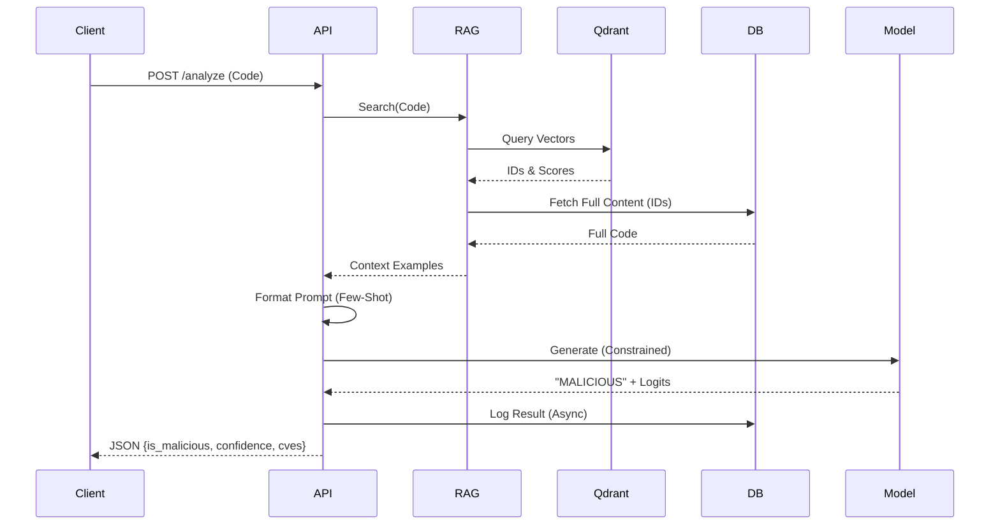

# ScriptGuard — Architektura i przepływy (prezentacja)

## Agenda slajdów
1. Cel systemu i zakres
2. High-level architektura (komponenty)
3. Punkty wejścia i tryby uruchomienia
4. Konfiguracja — mapa kluczy i zmiennych środowiskowych
5. Pipeline orkiestracji (ZenML) — przegląd
6. Flow treningu: Ingestia i Walidacja Danych
7. Flow treningu: Augmentacja i RAG (Qdrant)
8. Flow treningu: Wektoryzacja i Synchronizacja
9. Flow treningu: Fine-tuning (QLoRA)
10. Flow treningu: Ewaluacja
11. Flow inferencji: API i Lifecycle
12. Flow inferencji: RAG i Prompt Engineering
13. Flow inferencji: Generowanie i Post-processing
14. Flow inferencji: Logowanie i Monitoring
15. Zależności i integracje (zewnętrzne systemy)
16. Najbardziej istotne obserwacje z kodu

---

## Slajd 1: Cel systemu i zakres
- **Cel:** Wykrywanie złośliwego kodu (malware) w skryptach (Python, PowerShell, Bash) przy użyciu LLM (StarCoder2-3b) wspomaganego przez RAG (Retrieval-Augmented Generation).
- **Zakres:**
  - **Trening:** Pobieranie danych z wielu źródeł, czyszczenie, augmentacja, fine-tuning modelu.
  - **Inferencja:** API REST (FastAPI) do analizy skryptów w czasie rzeczywistym z wykorzystaniem bazy wiedzy (CVE, wzorce).
- **Kluczowa cecha:** Hybrydowe podejście łączące wiedzę parametryczną modelu (QLoRA) z wiedzą nieparametryczną (Qdrant Vector Store).

### Notatki prelegenta
System ScriptGuard to nie tylko wrapper na LLM. To kompletny ekosystem MLOps. Kod w `src/scriptguard` pokazuje zaawansowane techniki jak "Fetch-from-Source" w RAG (pobieranie pełnego kodu z DB zamiast z wektorów) czy "Constrained Decoding" w inferencji (wymuszanie tokenów BENIGN/MALICIOUS).

---

## Slajd 2: High-level architektura (komponenty)
- **Orkiestracja:** ZenML (`src/scriptguard/pipelines/training_pipeline.py`)
- **Baza Danych (Relacyjna):** PostgreSQL (`src/scriptguard/database/`) — "Source of Truth" dla kodu.
- **Baza Wektorowa:** Qdrant (`src/scriptguard/rag/`) — Wyszukiwanie semantyczne (kolekcje: `malware_knowledge`, `code_samples`).
- **Trening:** PyTorch + Unsloth/Transformers (QLoRA).
- **Inferencja:** FastAPI + Uvicorn (`src/scriptguard/api/main.py`).

```mermaid
flowchart TB
    subgraph DataSources [Źródła Danych]
        GH[GitHub]
        MB[MalwareBazaar]
        VX[VX-Underground]
        NVD[NVD CVE Feeds]
    end

    subgraph TrainingPipeline [ZenML Pipeline]
        Ingest[Ingestia & Deduplikacja]
        Valid[Walidacja & Sanityzacja]
        Augment[Augmentacja (Qdrant)]
        Vectorize[Wektoryzacja (Train Only)]
        Train[QLoRA Fine-tuning]
        Eval[Ewaluacja]
    end

    subgraph Storage [Storage]
        Postgres[(PostgreSQL\nPełny kod)]
        Qdrant[(Qdrant\nWektory)]
    end

    subgraph Inference [Inferencja API]
        FastAPI[FastAPI App]
        RAG[RAG Service]
        LLM[LLM (Adapter)]
    end

    DataSources --> Ingest
    Ingest --> Postgres
    Postgres --> Valid
    Valid --> Augment
    Augment --> Train
    Augment --> Vectorize
    Vectorize --> Qdrant
    Train --> LLM

    User -->|POST /analyze| FastAPI
    FastAPI --> RAG
    RAG -->|Search| Qdrant
    Qdrant -->|IDs| Postgres
    Postgres -->|Full Content| RAG
    RAG -->|Context| FastAPI
    FastAPI -->|Prompt| LLM
    LLM -->|Verdict| FastAPI
```

### Notatki prelegenta
Architektura rozdziela przechowywanie treści (Postgres) od wyszukiwania (Qdrant). Jest to widoczne w `src/scriptguard/rag/code_similarity_store.py::fetch_full_content_batch`. Pipeline treningowy (`advanced_training_pipeline`) jest sterowany przez ZenML i `config.yaml`.

---

## Slajd 3: Punkty wejścia i tryby uruchomienia
- **Trening (CLI):** `src/main.py::main`
  - Ładuje konfigurację.
  - Inicjalizuje Qdrant (`initialize_qdrant`).
  - Uruchamia `advanced_training_pipeline`.
  - **Ważne:** Monkey-patching dla Windows/Unsloth (`torch.compile = no_op_compile`).
- **Inferencja (API):** `src/scriptguard/api/main.py::app`
  - Uruchamiane przez `uvicorn`.
  - Lifecycle: `lifespan` ładuje model i łączy się z bazami.
- **Legacy:** `src/main.py::main_legacy` (stary pipeline `malware_detection_training_pipeline`).

### Notatki prelegenta
Plik `src/main.py` zawiera krytyczne obejścia (monkey-patches) dla PyTorch 2.5.1 i Windows (np. `torch._inductor.runtime.hints`), co sugeruje, że środowisko uruchomieniowe jest zróżnicowane (RunPod Linux vs lokalny Windows).

---

## Slajd 4: Konfiguracja — mapa kluczy i zmiennych środowiskowych

| Obszar | Klucze YAML (`config.yaml`) | Env Vars | Użycie w kodzie |
|--------|-----------------------------|----------|-----------------|
| **API Keys** | `api_keys.*` | `GITHUB_API_TOKEN`, `NVD_API_KEY`, `SCRIPTGUARD_API_KEY` | `src/scriptguard/steps/advanced_ingestion.py` |
| **Baza Danych** | `database.postgresql.*` | `POSTGRES_HOST`, `POSTGRES_USER`, `POSTGRES_PASSWORD` | `src/scriptguard/database/db_schema.py` |
| **Qdrant** | `qdrant.*` | `QDRANT_HOST`, `QDRANT_API_KEY` | `src/scriptguard/rag/qdrant_store.py` |
| **Model** | `training.model_id` | - | `src/scriptguard/steps/model_training.py` |
| **Cache** | `code_embedding.cache_dir` | `HF_CACHE_DIR` | `src/scriptguard/rag/embedding_service.py` |

### Notatki prelegenta
Funkcja `load_config` w `src/main.py` obsługuje substytucję zmiennych środowiskowych w formacie `${VAR:-default}`. Walidacja konfiguracji odbywa się przez Pydantic w `src/scriptguard/schemas/config_schema.py`.

---

## Slajd 5: Pipeline orkiestracji (ZenML) — przegląd
- **Definicja:** `src/scriptguard/pipelines/training_pipeline.py::advanced_training_pipeline`
- **Kroki:**
  1. `advanced_data_ingestion`: Pobranie danych.
  2. `validate_samples`: Sprawdzenie składni/długości.
  3. `filter_by_quality`: Odrzucenie śmieci.
  4. `extract_features`: Analiza (opcjonalna).
  5. **Split Data:** `split_raw_data` (przed augmentacją!).
  6. `augment_malicious_samples`: Generowanie wariantów.
  7. `augment_with_qdrant_patterns`: Wstrzyknięcie CVE z Qdrant.
  8. `vectorize_samples`: **Tylko zbiór treningowy** trafia do Qdrant (zapobieganie wyciekowi danych).
  9. `train_model`: QLoRA.
  10. `evaluate_model`: Test na surowym zbiorze testowym.

### Notatki prelegenta
Kluczowa obserwacja: `split_raw_data` jest wywoływane **przed** augmentacją, co jest poprawną praktyką (zapobiega data leakage). Wektoryzacja (`vectorize_samples`) również dotyczy tylko `train_data`, co oznacza, że RAG podczas treningu nie "widzi" danych testowych.

---

## Slajd 6: Flow treningu — Ingestia i Walidacja
- **Ingestia (`advanced_ingestion.py`):**
  - Źródła: GitHub, MalwareBazaar, VXUnderground, TheZoo, CVE Feeds, HuggingFace.
  - **Deduplikacja:** `src/scriptguard/database/dataset_manager.py` (hashowanie treści).
  - Zapis do PostgreSQL: `db_manager.add_sample`.
- **Walidacja (`code_sanitization.py`):**
  - Klasa `CodeSanitizer`.
  - Sprawdza: Entropię (min 3.5), binarne dane, długość linii (minifikacja), składnię AST (`_validate_python_syntax`).
  - Usuwa nagłówki licencyjne (`_remove_license_headers`).

### Notatki prelegenta
Ingestia jest bardzo rozbudowana. Ciekawostką jest `CVEFeedSource`, który pobiera opisy CVE i generuje z nich syntetyczne próbki ("exploit patterns") do treningu.

---

## Slajd 7: Flow treningu — Augmentacja i RAG (Qdrant)
- **Augmentacja Qdrant (`qdrant_augmentation.py`):**
  - Pobiera wzorce z kolekcji `malware_knowledge` (CVE).
  - Pobiera przykłady kodu z kolekcji `code_samples` (Few-Shot).
  - **Enrichment:** `ContextEnricher` dodaje metadane (ścieżka, repo) do treści kodu przed treningiem.
- **Cel:** Model uczy się nie tylko na kodzie, ale też na "wiedzy" o podatnościach zgromadzonej w Qdrant.

### Notatki prelegenta
Funkcja `augment_with_qdrant_patterns` łączy dane z dwóch kolekcji Qdrant i miesza je z danymi treningowymi. To sprawia, że model "widzi" to, co później będzie dostępne w RAG.

---

## Slajd 8: Flow treningu — Wektoryzacja i Synchronizacja
- **Krok:** `src/scriptguard/steps/vectorize_samples.py`
- **Proces:**
  1. Bierze `train_data`.
  2. Używa `CodeSimilarityStore` (`src/scriptguard/rag/code_similarity_store.py`).
  3. **Chunking:** `ChunkingService` dzieli długi kod na fragmenty z overlapem.
  4. **Embedding:** Model `microsoft/unixcoder-base` (konfigurowalny).
  5. **Upsert:** Wysyła wektory do Qdrant (kolekcja `code_samples`).
- **Ważne:** Czyści kolekcję przed wgraniem (`clear_existing=True`), aby usunąć stare dane.

### Notatki prelegenta
Wektoryzacja obsługuje "Batch Embedding" dla wydajności. Każdy chunk ma referencję do `db_id` w Postgresie, co umożliwia późniejsze pobranie pełnego kontekstu.

---

## Slajd 9: Flow treningu — Fine-tuning (QLoRA)
- **Krok:** `src/scriptguard/steps/model_training.py`
- **Konfiguracja (`config.yaml`):**
  - Model: `bigcode/starcoder2-3b`.
  - Metoda: QLoRA (`use_qlora: true`).
  - Parametry: `lora_r: 16`, `lora_alpha: 32`, `target_modules: [q_proj, v_proj, ...]`.
  - Precyzja: `bf16: true` (Bfloat16).
  - Optymalizator: `paged_adamw_8bit`.
- **Wyjście:** Adapter LoRA zapisany w `output_dir`.

### Notatki prelegenta
Użycie `paged_adamw_8bit` i `gradient_checkpointing` wskazuje na optymalizację pod GPU z ograniczoną pamięcią (np. 24GB VRAM na RunPod).

---

## Slajd 10: Flow treningu — Ewaluacja
- **Krok:** `src/scriptguard/steps/model_evaluation.py` (wywołany w pipeline).
- **Dane:** `raw_test_dataset` (niezmieniony, nieaugmentowany).
- **Metoda:**
  - Uruchamia inferencję na zbiorze testowym.
  - Może używać RAG (`use_fewshot_rag=True` w `advanced_training_pipeline`).
  - Porównuje predykcję z etykietą.
- **Metryki:** Accuracy, Precision, Recall, F1.



### Notatki prelegenta
Ewaluacja z włączonym RAG (`use_fewshot_rag=True`) jest kluczowa, aby zmierzyć rzeczywistą wydajność systemu w warunkach produkcyjnych.

---

## Slajd 11: Flow inferencji — API i Lifecycle
- **Plik:** `src/scriptguard/api/main.py`
- **Lifecycle (`lifespan`):**
  1. `app_state.load_config()`
  2. `app_state._load_model()` (ładuje Base Model + Adapter Peft).
  3. `app_state._load_rag()` (łączy z Qdrant).
  4. `app_state._init_db()` (łączy z Postgres).
- **Endpointy:**
  - `GET /health`, `GET /ready`
  - `POST /analyze` (główny endpoint).
- **Auth:** `verify_api_key` (sprawdza nagłówek `X-API-Key`).

### Notatki prelegenta
API używa `AppState` (singleton) do trzymania zasobów. Jest przygotowane na asynchroniczność (`async def analyze_script`), ale inferencja modelu jest blokująca (GPU), więc `uvicorn` powinien mieć limit workerów.

---

## Slajd 12: Flow inferencji — RAG i Prompt Engineering
- **Wyszukiwanie (`CodeSimilarityStore.search_similar_code`):**
  - Query -> Embedding -> Qdrant Search.
  - **Strategia:** "Always k" (fallbacki: strict -> default -> lenient -> no filters).
  - **Reranking:** `RerankingService` (Heurystyka + Cross-Encoder).
  - **Fetch-from-Source:** Pobiera pełny kod z Postgres (`fetch_full_content_batch`).
- **Prompt (`src/scriptguard/utils/prompts.py`):**
  - `format_fewshot_prompt`: Buduje prompt z sekcją "UNTRUSTED REFERENCE SAMPLES".
  - Zawiera "Guardrails" (instrukcje, by ignorować polecenia w próbkach).

### Notatki prelegenta
Mechanizm "Fetch-from-Source" jest krytyczny. Qdrant zwraca tylko metadane, a pełny kod jest dociągany z SQL. To pozwala ominąć limity payloadu w wektorowej bazie danych.

---

## Slajd 13: Flow inferencji — Generowanie i Post-processing
- **Generowanie (`api/main.py`):**
  - `BinaryClassificationLogitsProcessor`: Wymusza, aby pierwszy token był "BENIGN" lub "MALICIOUS".
  - `max_new_tokens=5`.
- **Confidence:**
  - Liczone z logitów pierwszego kroku (`_confidence_from_first_step_logits`).
  - Jeśli `constrained decoding` jest włączone, to jest to skalibrowane prawdopodobieństwo.
- **Parsowanie:** `parse_classification_output` (zwraca 0, 1 lub -1).

### Notatki prelegenta
Zastosowanie `LogitsProcessor` to bardzo zaawansowana technika, która gwarantuje, że model zawsze zwróci validną etykietę, zamiast halucynować.

---

## Slajd 14: Flow inferencji — Logowanie i Monitoring
- **Logowanie:**
  - `app_state.log_scan_result` (asynchronicznie, `BackgroundTasks`).
  - Zapisuje do tabeli `scan_history` w Postgres: `request_id`, `script_hash`, `verdict`, `confidence`, `latency`.
- **Monitoring:**
  - `X-Process-Time` w nagłówkach.
  - Logi aplikacyjne (logger).



### Notatki prelegenta
Logowanie jest asynchroniczne, co nie opóźnia odpowiedzi dla klienta. Hashowanie skryptu (`sha256`) pozwala na późniejszą analizę duplikatów.

---

## Slajd 15: Zależności i integracje (zewnętrzne systemy)
- **Qdrant:** Przechowuje wektory. Konfiguracja w `config.yaml::qdrant`.
- **PostgreSQL:** Przechowuje kod i historię. Konfiguracja w `config.yaml::database`.
- **HuggingFace:** Źródło modeli i datasetów. Token w `config.yaml::api_keys`.
- **GitHub/NVD/MalwareBazaar:** Źródła danych (API).
- **WandB:** Monitoring treningu (`config.yaml::training.report_to`).

### Notatki prelegenta
System jest silnie zintegrowany z zewnętrznymi API podczas fazy ingestii, ale podczas inferencji zależy tylko od lokalnych (lub kontenerowych) instancji Qdrant i Postgres.

---

## Slajd 16: Najbardziej istotne obserwacje z kodu
1. **Monkey-patching:** `src/main.py` agresywnie patchuje `torch` i `zenml` dla kompatybilności z Windows i Unsloth.
2. **Data Leakage Prevention:** Pipeline treningowy wyraźnie dzieli dane (`split_raw_data`) **przed** augmentacją i wektoryzacją.
3. **Fetch-from-Source:** RAG nie polega na danych w Qdrant (payload), lecz dociąga je z Postgresa (`ResultAggregator.fetch_full_content_batch`).
4. **Constrained Decoding:** API wymusza tokeny wyjściowe, co eliminuje błędy parsowania.
5. **Sanityzacja:** `CodeSanitizer` usuwa licencje i sprawdza entropię, co poprawia jakość embeddingów.
6. **Fallback w RAG:** `CodeSimilarityStore` ma 3 poziomy wyszukiwania (strict -> fallback -> last resort), co gwarantuje wyniki nawet przy słabym dopasowaniu.
7. **Chunking:** Używa `ChunkingService` z overlapem, co jest lepsze niż proste ucinanie kodu.
8. **Konfiguracja:** Bardzo rozbudowany `config.yaml` z obsługą zmiennych środowiskowych (RunPod friendly).

---

## Aneks: Indeks plików i symboli

| Plik | Kluczowe symbole | Rola |
|------|------------------|------|
| `src/main.py` | `load_config`, `main` | Entrypoint treningu, patche |
| `src/scriptguard/api/main.py` | `app`, `analyze_script` | Entrypoint API |
| `src/scriptguard/pipelines/training_pipeline.py` | `advanced_training_pipeline` | Definicja przepływu treningu |
| `src/scriptguard/rag/qdrant_store.py` | `QdrantStore`, `bootstrap_cve_data` | Obsługa CVE w Qdrant |
| `src/scriptguard/rag/code_similarity_store.py` | `CodeSimilarityStore`, `upsert_code_samples` | Obsługa kodu w Qdrant |
| `src/scriptguard/rag/code_sanitization.py` | `CodeSanitizer` | Czyszczenie danych |
| `src/scriptguard/database/dataset_manager.py` | `DatasetManager` | CRUD Postgres |
| `src/scriptguard/steps/model_training.py` | `train_model` | Wrapper na QLoRA |
